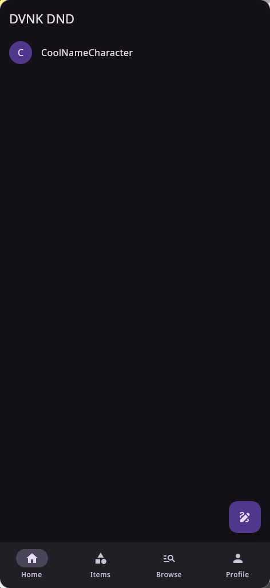
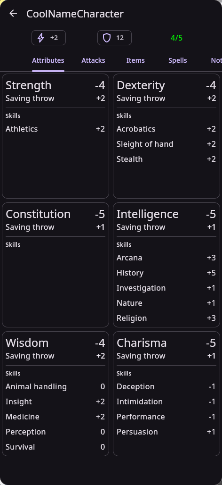
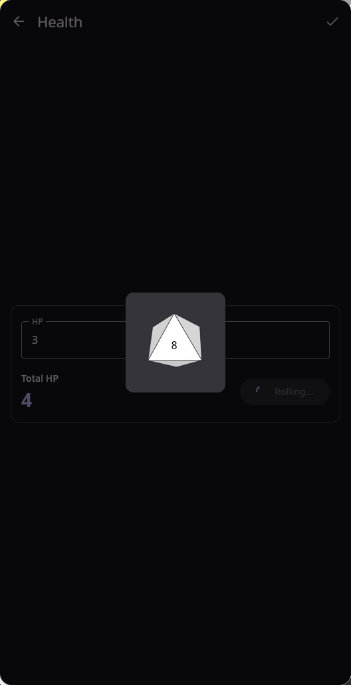

# DVNKDnD

> 🧙‍♂️ **Kotlin Multiplatform Dungeons & Dragons Companion App**
> A cross-platform DnD character manager for **Android**, **iOS**, and **Desktop** built with **Compose Multiplatform**.

**Repository:** [Davanok/DVNKDnD](https://github.com/Davanok/DVNKDnD)

---

## 📚 Table of Contents

* [About](#-about)
* [Features](#-features)
* [Project Structure](#-project-structure)
* [Getting Started](#-getting-started)
    * [Requirements](#requirements)
    * [Build & Run](#build--run)
      * [Android](#-android)
      * [Desktop](#-desktop)
      * [iOS](#-ios)
* [Configuration](#-configuration)
* [Examples](#examples)
* [Contributing](#-contributing)
* [License](#-license)
* [Contact](#-contact)
* [Acknowledgements](#-acknowledgements)

---

## 🧩 About

**DVNKDnD** is a **Kotlin Multiplatform** project targeting **Android**, **iOS**, and **Desktop (JVM)**.
It uses **Compose Multiplatform** for a shared UI and unified business logic, allowing most of the code to be reused across all platforms.

**Goal:**
Provide an automatic, cross-platform DnD character manager for easier gameplay and session tracking.

---

## ✨ Features

* 🧱 Shared UI with **Compose Multiplatform**
* 📱 Native Android and iOS targets
* 💻 Desktop (JVM) support
* ⚙️ Shared logic in `commonMain`
* 🧾 Kotlin + Gradle Kotlin DSL build setup

---

## 🧭 Project Structure

```
DVNKDnD/
├── composeApp/                 # Main shared module (UI & Logic)
│   ├── build.gradle.kts
│   └── src/
│       ├── commonMain/         # 🧠 CORE SHARED LOGIC & UI
│       │   ├── composeResources/ # Shared assets (Drawables, Strings, Fonts)
│       │   └── kotlin/com/davanok/dvnkdnd/
│       │       ├── App.kt      # Main Entry Point / Root Composable
│       │       ├── core/       # Utilities, Converters, Ext functions
│       │       ├── data/       # 💾 DATA LAYER (Implementations)
│       │       │   ├── db/     # Database definitions & DAOs (Room)
│       │       │   ├── files/  # File system handling
│       │       │   ├── mappers/# DTO to Domain mappers
│       │       │   └── repositories/ # Repository Implementations
│       │       ├── domain/     # 📐 DOMAIN LAYER (Business Logic)
│       │       │   ├── dnd/    # DnD specific logic (Rules, Utils)
│       │       │   ├── entities/ # Core Models (Character, Spells, Items)
│       │       │   ├── enums/  # Game constants (Dice, DamageTypes, etc.)
│       │       │   ├── repositories/ # Interfaces
│       │       │   └── usecases/ # Interactors
│       │       └── ui/         # 🎨 PRESENTATION LAYER (Compose)
│       │           ├── components/ # Reusable UI widgets
│       │           │   ├── adaptive/   # Responsive/Window layout logic
│       │           │   ├── diceRoller/ # 3D Dice rendering logic
│       │           │   └── ...
│       │           ├── navigation/ # Navigation graph & Routes
│       │           ├── pages/      # Feature Screens
│       │           │   ├── characterFull/ # Main Character Sheet
│       │           │   ├── charactersList/
│       │           │   └── newEntity/     # Creation Wizards
│       │           ├── theme/      # Colors & Typography
│       │           └── viewmodels/ # Shared ViewModels
│       │
│       ├── androidMain/        # 🤖 Android Specific Implementations
│       │   ├── AndroidManifest.xml
│       │   └── .../platform/   # Android platform bindings
│       │
│       ├── desktopMain/        # 🖥️ Desktop (JVM) Specific Implementations
│       │   └── .../platform/   # Desktop platform bindings
│       │
│       └── iosMain/            # 🍎 iOS (Kotlin) Specific Implementations
│           └── .../platform/   # iOS platform bindings
│
├── iosApp/                     # Native iOS Shell (SwiftUI)
│   └── iosApp/
│       └── iOSApp.swift        # iOS Entry point calling Shared UI
│
├── gradle/                     # Build configurations & Version Catalog
└── settings.gradle.kts
```

---

## 🚀 Getting Started

### Requirements

* **JDK 17+** (JDK 11 minimum)
* **Gradle Wrapper** (included)
* **Kotlin** (configured via Gradle)
* **Android Studio** / **IntelliJ IDEA** for full support

---

### Build & Run

#### 🛠 General

```bash
# Build all targets
./gradlew :composeApp:build

# Assemble outputs
./gradlew :composeApp:assembleDebug
./gradlew :composeApp:assembleRelease
```

---

#### 🤖 Android

```bash
# Build APK
./gradlew :composeApp:assembleDebug
./gradlew :composeApp:assembleRelease

# Install on device
./gradlew :composeApp:installDebug

# Uninstall
./gradlew :composeApp:uninstallDebug

# View signing info
./gradlew :composeApp:signingReport
```

---

#### 🖥 Desktop

```bash
# Run desktop app (JVM)
./gradlew :composeApp:run

# Package desktop distributables
./gradlew :composeApp:createDistributable
./gradlew :composeApp:createReleaseDistributable
```

---

#### 🍎 iOS

```bash
# Build for simulator
./gradlew :composeApp:linkDebugFrameworkIosSimulatorArm64

# Build for device
./gradlew :composeApp:linkReleaseFrameworkIosArm64

# Build all iOS binaries
./gradlew :composeApp:iosSimulatorArm64Binaries
./gradlew :composeApp:iosArm64Binaries

# Embed + sign for Xcode
./gradlew :composeApp:embedAndSignAppleFrameworkForXcode
```

---

## ⚙️ Configuration

Use a `config.properties` file (excluded from version control) for sensitive data such as API keys:

```properties
SUPABASE_URL=https://<your_project>.supabase.co
SUPABASE_KEY=<your_api_key>
```

Ensure this file is not committed to Git.

---

## Examples

### Screenshots

| Character List                                      | Character Page                                    | Dice Throws                                  |
|-----------------------------------------------------|---------------------------------------------------|----------------------------------------------|
|  |  |  |

---

## 🤝 Contributing

Contributions are welcome!
To contribute:

1. Fork the repository
2. Create a feature branch:

   ```bash
   git checkout -b feat/my-feature
   ```
3. Commit your changes
4. Open a Pull Request describing your updates

---

## 📄 License

This project is licensed under the **MIT License**.

---

## 👤 Contributors

* **Davanok** — creator and maintainer

---

## 📬 Contact

For issues or feature requests, please open a GitHub Issue in the repository.

---

## 💡 Acknowledgements

* [JetBrains](https://jetbrains.com) — Kotlin Multiplatform & Compose
* [Supabase](https://supabase.com) — Backend integration
* Open-source libraries used in this project
